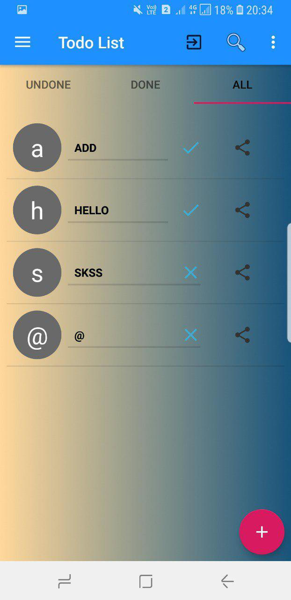
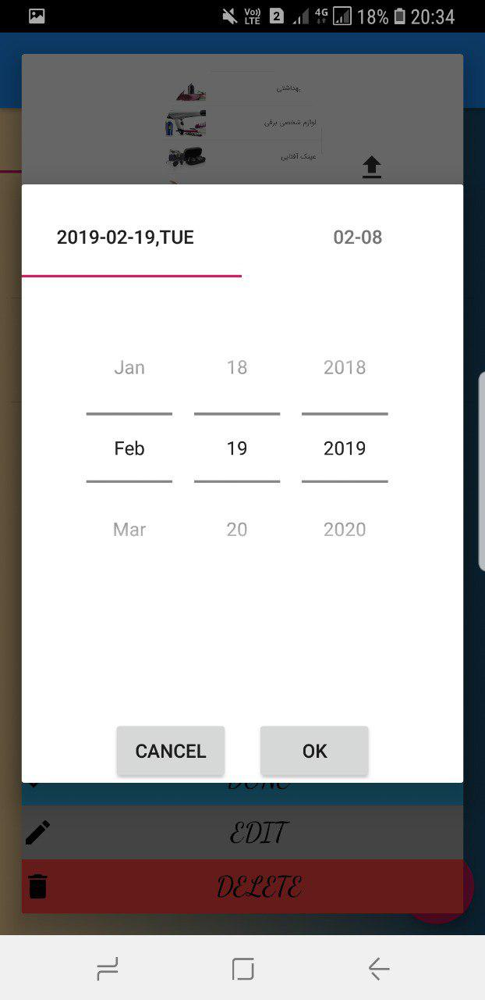

# android_task_manager
a local android task manager application use ORM Green dao database with users and tasks and used many design patterns such as singleton and repository and adapter , login page for sign up and handle forget password by send password to the email account.

